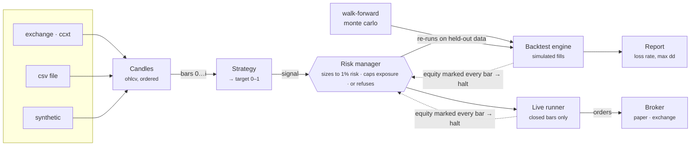
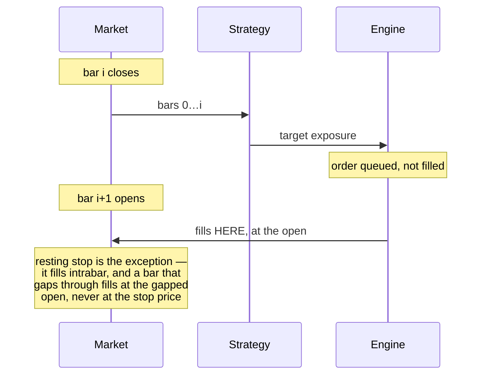
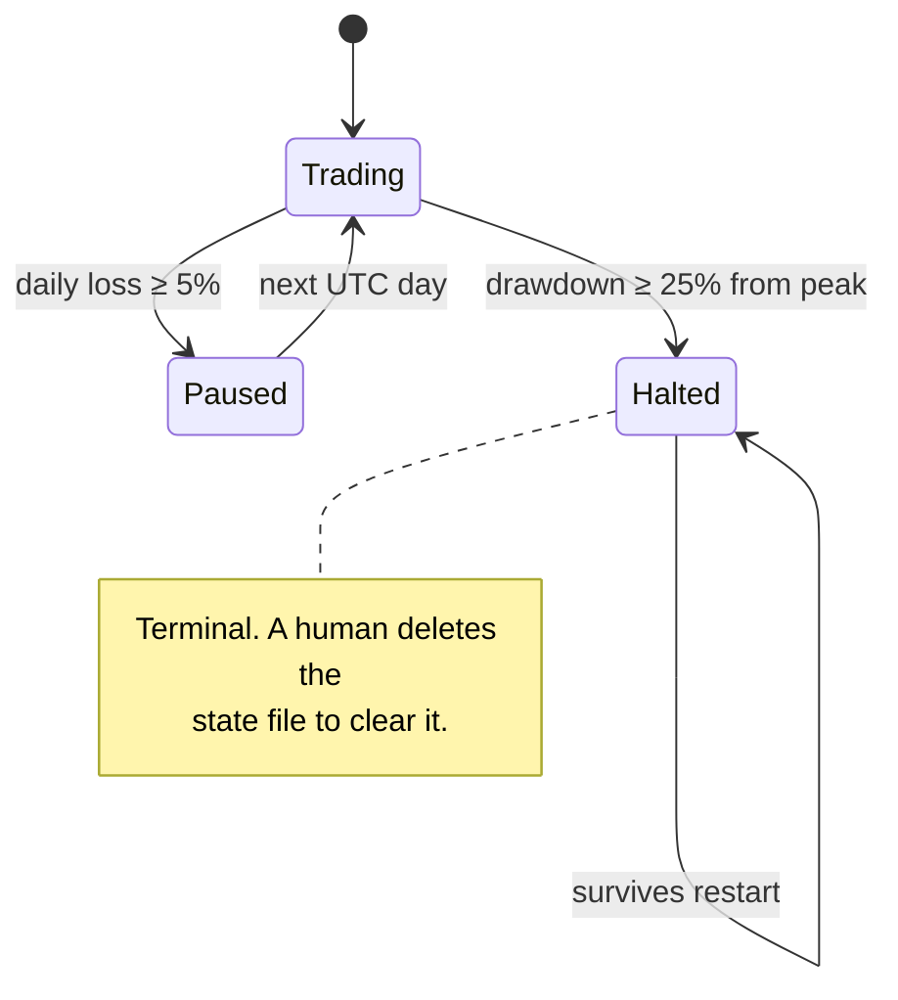

# Architecture

Every order passes one gate. That is the structure, and everything else is
arrangement around it.

## The pipeline



Two properties this buys:

- **One gate, two paths.** The backtest engine and the live runner share the
  strategy and the risk manager. If going live needed a different code path,
  that path would be the least-tested code in the project and the most
  expensive to get wrong.
- **The harness drives the engine.** Walk-forward and Monte Carlo are not
  reports; they re-run the engine on data the optimiser never saw. That is how
  `vol-target`'s 398% headline resolves to +4.7% out-of-sample.

The feedback edge is the kill switch, and it marks *unrealised* equity, so it
fires during the open position doing the damage rather than after it closes.

## When an order fills



Filling at the close of the bar that produced the signal is the most common
backtesting bug in this space, and it is worth roughly the entire apparent edge
of most published strategies. `test/no-lookahead.test.ts` enforces the rule as a
property rather than a convention.

## Kill switch states



Drawdown is measured from the peak, not from the starting balance: up 400% then
down 60% trips the switch, because that is when a strategy has stopped working.
The flag is persisted, so a container that crashes and restarts comes back still
halted — a kill switch that resets on restart is a pause between attempts at the
same loss, not a halt.

## Where the code lives

| directory | owns |
|---|---|
| `domain/` | Value types shared by every layer. No exchange clients, no clocks, no filesystem. |
| `indicators/` | Causal only: slot `i` is computed from inputs `0…i` and is null until enough history exists. |
| `strategy/` | Single-asset strategies and the registry. One rule to add another: `signalAt(i)` may not read past `i`. |
| `risk/` | Position sizing, daily loss pause, drawdown kill switch. The gate above. |
| `backtest/` | Engine, cost model, metrics, walk-forward, Monte Carlo. |
| `portfolio/` | Multi-asset engine and timestamp alignment by intersection — never forward fill, which invents prices that never traded. |
| `data/` | Exchange fetch with disk cache, date ranges, CSV, and a seeded generator so the suite runs offline. |
| `live/` | Broker interface, paper broker, gated exchange broker, and the runner that records the last bar it acted on. |

## The smallest account that can trade

Risk-based sizing makes the position a fraction of equity, so below some balance
that fraction falls under the exchange minimum and every order is rejected.

```
position fraction = min(maxPositionPct, riskPerTradePct / stopDistancePct)
minimum equity    = minOrderNotional / position fraction
```

At 1% risk with a 2.5×ATR stop roughly 10% below entry, the position is about a
tenth of the account, so a $1 exchange minimum needs about **$10** before a
single order is legal. `minimumViableEquity()` computes it, and the backtest
report prints a warning when the configured equity falls below it.

Run the tool at $5 and it reports what actually happens: 259 orders below the
minimum and never placed, and one trade in eight years. Not a bad return — no
return, because there was nothing to trade with.
